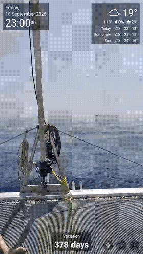

# AOFrame

A native Android app for Frameo-based digital photo frames — a
lightweight, purpose-built slideshow with weather, clock, an optional
countdown, and live webcam clips, backed by [Immich](https://immich.app/)
(or fully self-hosted, no Immich required). Built to replace Frameo's own
kiosk UI and any browser-based dashboard approach with something native,
low-overhead, and tuned for the low-end, passively-cooled hardware these
frames typically ship with.



## Why

Frameo-based frames are cheap, decent hardware locked behind a
proprietary app with no useful customization — but they're also rooted,
ADB-accessible Android devices under the hood (see
[`docs/hardware-and-root.md`](docs/hardware-and-root.md)). AOFrame runs
natively on that hardware instead of routing through a browser engine,
which turned out to matter a lot on constrained, thermally-limited
devices — see [`docs/performance-notes.md`](docs/performance-notes.md)
for the measured before/after.

## Features

- Full-screen photo/video slideshow with a face-targeted Ken Burns
  pan/zoom, sourced from Immich (or a local, self-hosted photo store —
  see below)
- Live weather widget (current conditions + short forecast, optional
  separate sea-surface temperature), hidden entirely if not configured
- Optional on-screen countdown to a target date
- Scheduled night mode (real display sleep/wake, not just pausing)
- Live webcam clips mixed into the normal photo rotation
- A local on-device HTTP API for remote control/config — no in-app
  settings screen; see [`docs/local-control-server-api.md`](docs/local-control-server-api.md)
- **Immich-optional**: run entirely without an Immich instance via
  `photoSource: local`, backed by the included reference server's CRUD
  photo API

## Repo layout

| Path | What it is |
|---|---|
| [`app/`](app/) | The Android app itself (Kotlin, plain Views, minSdk 27) |
| [`pi-video-gate/`](pi-video-gate/) | Optional sidecar: fixes a video-readiness race and adds an fps cap Immich itself doesn't support |
| [`server/`](server/) | Optional reference admin server: remote-editing dashboard + the CRUD photo API for local mode |
| [`scripts/`](scripts/) | Optional on-device tweaks (persistent network ADB, a CPU governor switch to reduce thermal throttling) |
| [`docs/`](docs/) | Setup guide, hardware/root notes, API references, architecture notes |

## Quick start

See [`docs/setup-guide.md`](docs/setup-guide.md) for the full walkthrough.
In short:

```
cd app
cp immich-secrets.example.json immich-secrets.json   # fill in your values
./release.sh                                         # build, install, launch
```

## Docs

- [`docs/setup-guide.md`](docs/setup-guide.md) — start here
- [`docs/hardware-and-root.md`](docs/hardware-and-root.md) — getting root/ADB access on Frameo-based hardware
- [`docs/app-architecture.md`](docs/app-architecture.md) — why the app is built the way it is
- [`docs/performance-notes.md`](docs/performance-notes.md) — measured tuning results for constrained hardware
- [`docs/immich-api-notes.md`](docs/immich-api-notes.md) — Immich API quirks this app works around
- [`docs/local-control-server-api.md`](docs/local-control-server-api.md) — the on-device HTTP API reference
- [`docs/reference-server-dev-walkthrough.md`](docs/reference-server-dev-walkthrough.md) — how the optional server is built
- [`docs/home-assistant-integration.md`](docs/home-assistant-integration.md) — wiring this into Home Assistant

## Security posture

The on-device control API and the optional reference server both have
**no authentication** — they're meant for a trusted LAN only. Don't
expose either to the internet; put them behind a VPN if you need remote
access. See each component's own docs for details.

## License

MIT with the [Commons Clause](https://commonsclause.com/) — free to use,
modify, and distribute, including for personal and internal business
use, but **selling the software itself (or a hosted/consulting service
whose value derives substantially from it) requires a separate
commercial license.** See [`LICENSE`](LICENSE) for the full terms and
contact info.
